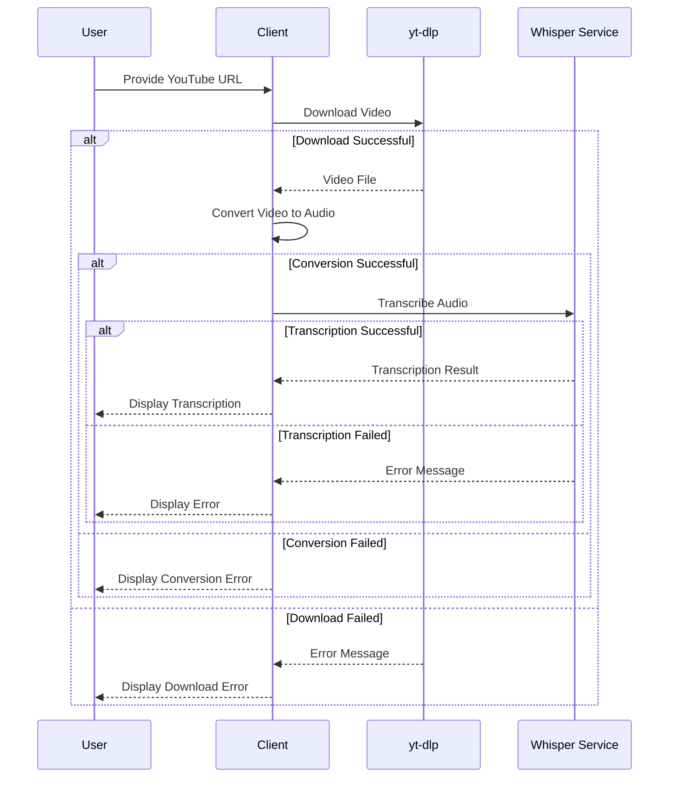

# Sequence Diagram for YouTube Transcription Process

## Description

- **User**: Initiates the transcription process by providing a YouTube URL.
- **Client**: Manages the overall process, including downloading, converting, and transcribing.
- **yt-dlp**: Downloads the video from YouTube.
- **Whisper Service**: Transcribes the audio to text.
- The process includes error handling at each stage, with appropriate messages displayed to the user.
