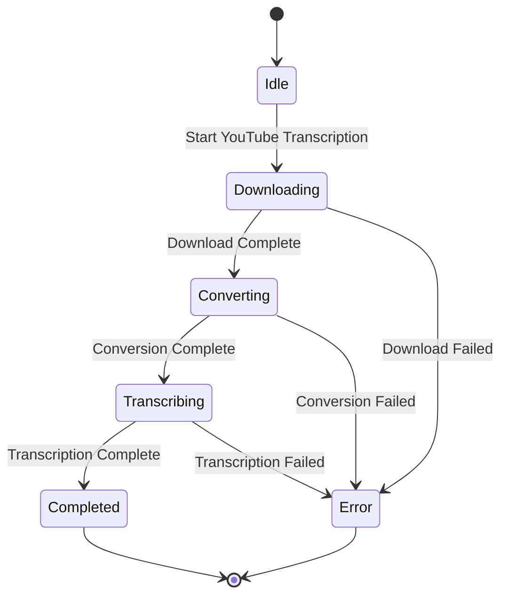

# State Diagram for Whisper Client

## Description

- **Idle**: The client is waiting for a command.
- **Downloading**: The client is downloading the YouTube video.
- **Converting**: The client is converting the video to audio format.
- **Transcribing**: The client is transcribing the audio to text.
- **Completed**: The transcription process is successfully completed.
- **Error**: An error occurred during any of the stages.
